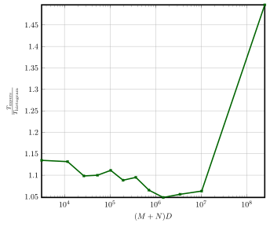
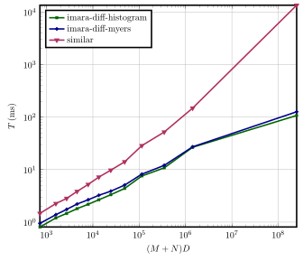
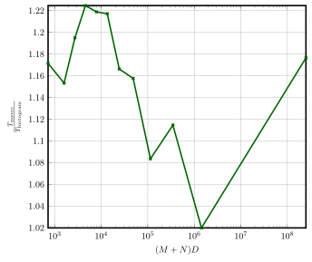
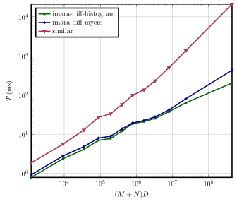
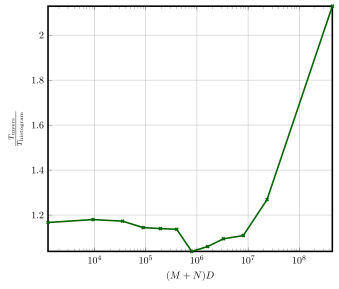
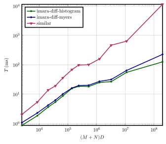
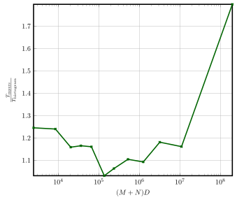

# imara-diff

`imara-diff` is a solid (imara in swahili) diff library for rust.
Solid refers to the fact that imara-diff provides very good runtime performance even
in pathologic cases so that your application never appears to freeze while waiting on a diff.
The performance improvements are achieved using battle tested heuristics used in gnu-diff and git
that are known to perform well while still providing good results. 

`imara-diff` is also designed to be flexible so that it can be used with arbitrary collections and
not just lists and strings and even allows reusing large parts of the computation when
comparing the same file to multiple different files.

`imara-diff` provides two diff algorithms:

* The linear-space variant of the well known [Myers algorithm](http://www.xmailserver.org/diff2.pdf) 
* The **Histogram** algorithm which variant of the patience diff algorithm.

Myers algorithm has been enhanced with preprocessing and multiple heuristics to ensure fast runtime in pathological 
cases to avoid quadratic time complexity and closely matches the behavior of gnu-diff and git.
The histogram algorithm was originally ported from git but has been heavily optimized.
The **Histogram algorithm outperforms Myers algorithm** by 10% - 100% across a **wide variety of workloads**.

## Limitations

Even with the optimizations in this crate, performing a large diff without any tokenization (like character diff for a string) does not perform well.
To work around this problem a diff of the entire file with large tokens (like lines for a string) can be performed first.
The `Sink` implementation can then perform fine-grained diff on changed regions.
Note that this fine-grained diff should not be performed for pure insertions, pure deletions and very large changes.

In an effort to improve performance, `imara-diff` makes heavy use of pointer compression.
That means that it can only support files with at most `2^31 - 2` tokens.
This should be rarely an issue in practice for textual diffs, because most (large) real-world files 
have an average line-length of at least 8.
That means that this limitation only becomes a problem for files above 16GB while performing line-diffs.

## Benchmarks

The most used diffing libraries in the rust ecosystem are [similar](https://crates.io/crates/similar) and [dissimilar](https://crates.io/crates/dissimilar).
The fastest diff implementation both of these offer is a simple implementation of Myers algorithm
without preprocessing or additional heuristics.
As these implementations are very similar only `similar` was included in the benchmark.

To provide a benchmark to reflects real-world workloads, the git history of different open source projects were used.
For each repo two (fairly different) tags were chosen.
A tree diff is performed with [gitoxide](https://github.com/Byron/gitoxide) and the pairs of files that should be saved are stored in memory.
The diffs collected using this method are often fairly large, because the repositories are compared over a large span of time.
Therefore, the tree diff of the last 30 commit before the tag (equivalent of `git diff TAG^ TAG`, `git diff TAG^^ TAG^^`) were also used to also include smaller diffs.

The benchmark measures the runtime of performing a **line diff** between the collected files.
As a measure of complexity for each change `(M + N) D` was used where `M` and `N` are the lengths of the two compared files
and `D` is the length of the edit script required to transform these files into each other (determined with Myers algorithm).
This complexity measure is used to divide the changes into 10 badges.
The time to compute the line diffs in each badge was benchmarked.

The plots below show the runtime for each **average** complexity (runtime is normalized by the number of diffs).
Note that these plots are shown in logarithmic scale due to the large runtime of `similar` for complex diffs.
Furthermore, to better highlight the performance of the Histogram algorithm, the speedup of the Histogram algorithm
compared to the Myers algorithm is shown separately.

* [Linux](###Linux)
* [Rust](###Rust)
* [VSCode](###VSCode)
* [Helix](###Helix)

### Linux

The sourcecode of the linux kernel.

- **Repo** - https://kernel.org
- **Tags** - `v5.7` and `v6.0`

### Rust

The sourcecode of the rust compiler, standard library and various related tooling.

- **Repo** - https://github.com/rust-lang/rust
- **Tags** - `1.50.0` and `1.64.0`

### VScode

The sourcecode of the vscode editor.

- **Repo** - https://github.com/microsoft/vscode
- **Tags** - `1.41.0` and `1.72.2`

### Helix

The sourcecode of the helix editor.

- **Repo** - https://github.com/helix-editor/helix
- **Tags** - `v0.5.0` and `22.08.1`

## Stability Policy

`imara-diff` uses [Semantic Versioning (SemVar)](https://semver.org/).
All non-breaking changes to the public rust API will cause a minor `SemVar` bump.
All breaking changes to to the public rust API will cause a major `SemVar` bump.
Changes in the produced diffs are also considered breaking changes if the produced diff was valid.
If the produced diff was invalid the change will be considered a bugfix.

Additionally all changes to the minimum stable rust version (MSRV) are also considered breaking changes.
The current **MSRV is 1.61**.
`imara-diff` will roughly follow the MSRV of Firefox (stable) to remain
compatible many platforms that try to include its latest version.
To predict future changes to the MSRV the [Firefox documentation] can be consulted.

[Firefox documentation]: https://firefox-source-docs.mozilla.org/writing-rust-code/update-policy.html
